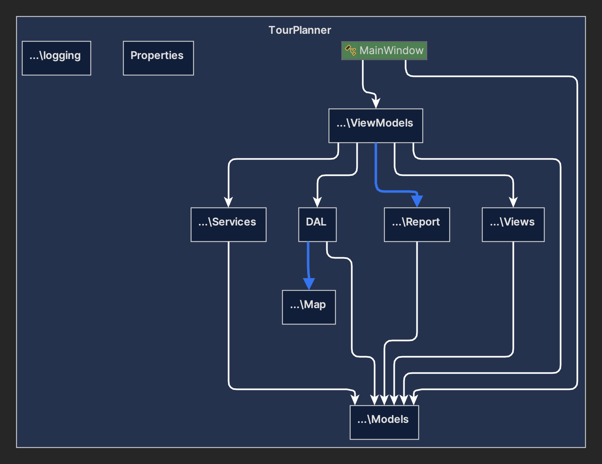
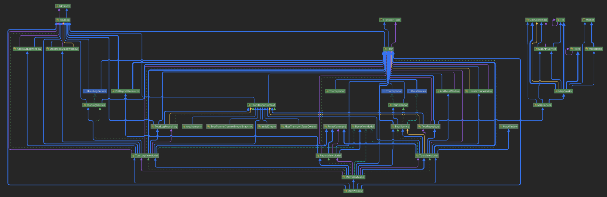
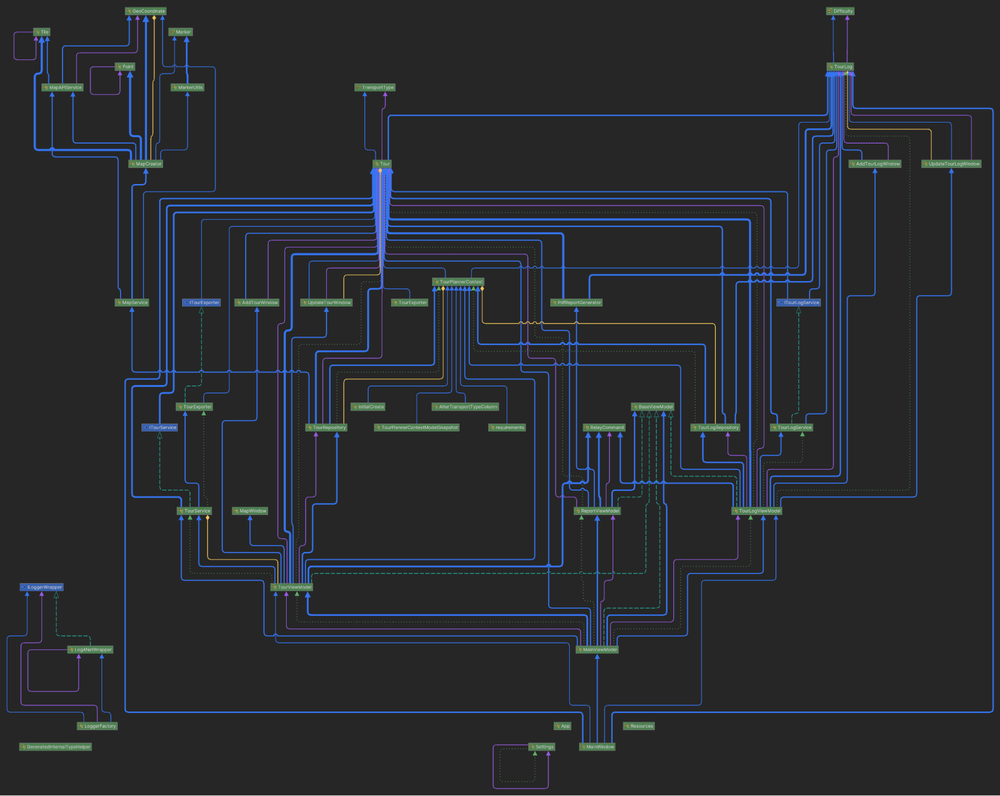
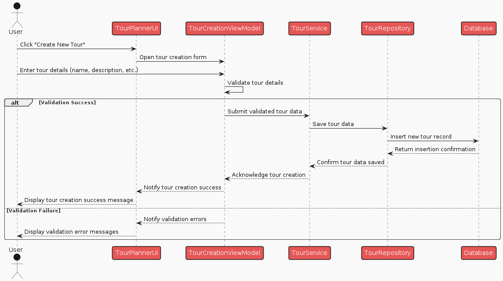
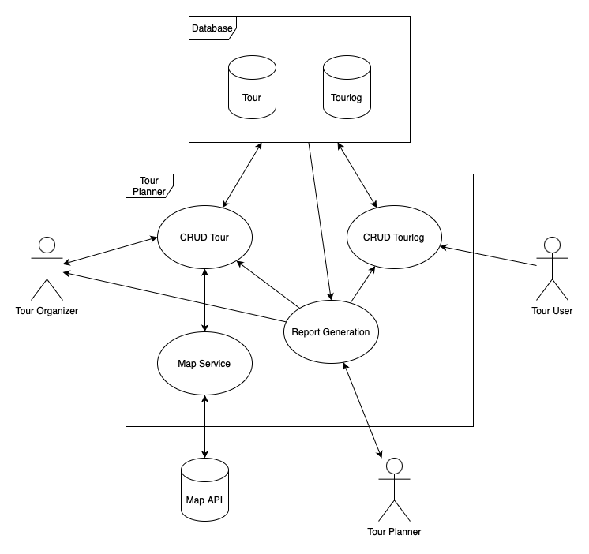
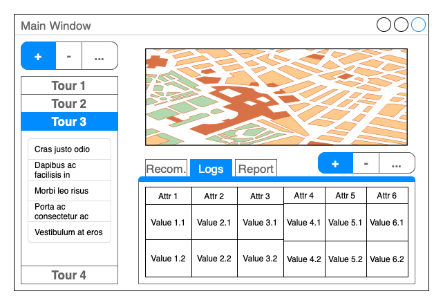

# SWEN-2 Tour Planner 
Protocol:

## Inhaltsverzeichnis

- [1. Project Overview](#1-project-overview)
- [Team Members](#team-members)
- [2. Design and Architecture](#2-design-and-architecture)
- [Application Architecture](#application-architecture)
- [3. UI Flow / Wireframe](#3-ui-flow--wireframe)
- [3.1. Main Window](#31-main-window)
- [4. Technical Decisions and Steps](#4-technical-decisions-and-steps)
- [4.1. Design Patterns](#41-design-patterns)
- [4.2. MVVM Implementation](#42-mvvm-implementation)
- [4.3. Layer-Based Architecture](#43-layer-based-architecture)
- [4.4. Configuration File](#44-configuration-file)
- [4.5. External Libraries](#45-external-libraries)
- [5. Unit Tests](#5-unit-tests)
- [6. Unique Feature](#6-unique-feature)
- [7. Time Tracking](#7-time-tracking)
- [8. Lessons Learned](#8-lessons-learned)
- [9. Git Repository Link](#9-git-repository-link)

# 1. Project Overview

The Tour Planner application is designed to allow users to create, manage, and log various types of tours. Users can view and modify tours, add logs, and generate detailed reports. The application employs C# and WPF for the graphical user interface, adhering to the MVVM pattern, and uses PostgreSQL for data storage.

## Team Members:

* Yannick NWANKWO
* Donya MOHARAM

# 2. Design and Architecture

## Application Architecture

The application follows a layered architecture consisting of:

* UI Layer: Manages user interactions and displays data (WPF, XAML).
* Business Layer (BL): Contains the core functionality and business logic.
* Data Access Layer (DAL): Manages data storage and retrieval using Entity Framework and PostgreSQL.

1. UI Layer:

Handles the graphical user interface and user interactions.

Utilizes WPF and XAML for the front-end design.

Implements data binding to connect the UI with the ViewModel.

2. Business Layer:

Contains the application logic and rules.

Handles the communication between the UI Layer and the DAL.

Implements business processes like CRUD operations, data validation, and computations.

3. Data Access Layer:

Manages database operations using Entity Framework.

Handles data persistence and retrieval from PostgreSQL.

Implements a repository pattern for clean data access.

### 4. Diagrams

#### 1. Project Structure Diagram:

#### 2. Class Diagram:

#### 3. Sequence diagram:

[Plant UML Sequence Diagram](#https://www.google.com/url?q=http://www.plantuml.com/plantuml/png/dPDFRnCn4CNl_XH3Jo2rV80UK54AKWyKrDBUf_PBiUe_qNXsetvxxAob9UcoGkHWoPhtUsycdhqgog933EQT_a84HPPYs6eMUYWGOzf95v_ePnxaH-2K80ytT4cRuEqBdMq4hA1Rx0-ACtEiw-11vNDwzDX_omwX6dpV8P7M8jbUfMsME0MkS5-IGYRGGTc7GkyJHvpNQx7YTmqu9wZz-C4icwouFtBmZXL70OQ3zahJq_rWBKenL7-h2VUGqLlGPKMUebSQkxth_gpSNMPnP--moyLhbjU6yuW5PDOqwhgMdhYqk9jK84e9-uaIs2okSRFgOYde3Zf88d_WswmsfwsNoEsocFjcrCr4pErIuH7kxPmhp_3PlgIy3t3FEDwHjVzyOKjli_hjwycQbPFdcu5cqVQlajU-x0B_1QLO3tw6GIZuSpE-iW-3uF-w76SVY6JvnmvFiTuSYa5ovgeUxVl-3G00&sa=D&source=editors&ust=1718560035238205&usg=AOvVaw24kZH6AelwVgvZaOI5PSFg)

#### 4. Use-Case Diagram:

[Tour-Planner.](#https://www.google.com/url?q=https://drive.google.com/file/d/1ds2mOEaDcHc6_jmKTlZcnbtiew4udV_-/view?usp%3Dsharing&sa=D&source=editors&ust=1718560035238936&usg=AOvVaw2j7NNa2JIV6utBaLux_T-N)[drawio](#https://www.google.com/url?q=https://drive.google.com/file/d/1ds2mOEaDcHc6_jmKTlZcnbtiew4udV_-/view?usp%3Dsharing&sa=D&source=editors&ust=1718560035239247&usg=AOvVaw1HgMvT8NPoVefu-JMnsQ4D)

3. # UI Flow / Wireframe

1. ## Main Window

[Tour-Planner\_Wireframe\_Main-Window.](#https://www.google.com/url?q=https://drive.google.com/file/d/11MJLzYFcYncJcqSvCHw--I8-DmrAt6hK/view?usp%3Dsharing&sa=D&source=editors&ust=1718560035240021&usg=AOvVaw1YlDGRDQYLKDZl99H_TDss)[drawio](#https://www.google.com/url?q=https://drive.google.com/file/d/11MJLzYFcYncJcqSvCHw--I8-DmrAt6hK/view?usp%3Dsharing&sa=D&source=editors&ust=1718560035240291&usg=AOvVaw30AdDlFdmLRwU3b-4QMnAu)

4. # Technical Decisions and Steps

1. ## Design Patterns

We implemented the following design patterns:

MVVM (Model-View-ViewModel): This pattern was used to separate the UI from the business logic.

Repository Pattern: For data access, allowing the business logic to interact with a clean and decoupled data access layer.

Factory Pattern: To manage the creation of complex objects.

2. ## MVVM Implementation

Model: Represents the tour and log data.

View: XAML files that define the UI.

ViewModel: Handles the interaction between the Model and View, processing user input and updating the UI.

3. ## Layer-Based Architecture

UI Layer: Manages user interactions and displays data (WPF, XAML).

Business Layer (BL): Contains the core functionality and business logic.

Data Access Layer (DAL): Manages data storage and retrieval using Entity Framework and PostgreSQL.

4. ## Configuration File:

Used for storing DB connection string and API key.

5. ## External Libraries:

NUnit

QuestPDF

Log4net

Entity Framework

MOQ

Newtonsoft.Json

Npgsql

5. # Unit Tests

The tested code is crucial because it ensures the core functionalities of the Tour Planner application work correctly. This includes adding, updating and deleting tours and tour logs, as well as importing and exporting data. 

TourLogServiceTests:

1. AddTourLog\_WhenValidTourLogProvided\_ShouldAddTourLogToTour
* Purpose: Ensures that a valid TourLog is successfully added to a Tour.
2. UpdateTourLog\_WhenExistingTourLogProvided\_ShouldUpdateTourLogInTour
* Purpose: Checks if an existing Tour Log is properly updated in a Tour
* Importance: Updating Tour Logs is crucial for maintaining up-to-date information.
3. DeleteTourLog\_WhenExistingTourLogProvided\_ShouldRemoveTourLogFromTour
* Purpose: verifies that an existing Tour Log is correctly removed from a Tour

 TourServiceTests:

1. AddTour\_AddsTourToCollection
* Ensures that a new Tour is added to the collection
2. UpdateTour\_UpdatesTourInCollection
* Verifies that a Tour is properly updated in a collection
3. DeleteTour\_RemovesTourFromCollection
* Checks if a Tour is correctly removed from the collection
4. ExportToursToJson\_ExportToursToFile
* Ensures that tours are correctly exported to a JSON file
5. ImportToursFromJson\_ImportToursFromFile
* Ensures that tours are correctly imported from a JSON file
6. # Unique Feature

The unique feature we implemented is a Top Tours tab that acts as a recommendation. Based on the popularity of the tours, the top three tours get recommended to the user. 

7. # Time Tracking

Week 1-3: Requirements gathering, initial design, and setup.

Week 4-6: Implementation of core features (CRUD operations, MVVM pattern).

Week 5: Intermediate Hand-In.

Week 7-8: Database connection with entity framework.

Week 9-11: Integration of OpenRouteService API, logging, and report generation.

Week 12-14: Unit testing, bug fixing, and documentation.

Week 15-16: Final presentation preparation and protocol completion.

~100h

8. # Lessons Learned

Understanding MVVM and Layer-Based Architecture

Implementing the MVVM pattern and a layer-based architecture was initially challenging but proved beneficial for maintainability and scalability. Understanding the separation of concerns between the UI, business logic, and data access layers enhanced our code organization.

Integration of External APIs

Integrating the OpenRouteservice.org and OpenStreetMap APIs required thorough documentation review and testing. This integration added significant value by automating route information and tile retrieval.

Error Handling and Logging

Incorporating log4net for logging was instrumental in monitoring application behavior and debugging. Proper error handling and logging practices allowed us to quickly identify and resolve issues, leading to a more robust application.

Unit Testing

Developing comprehensive unit tests with NUnit ensured that our application functions as intended and helped catch bugs early. Writing these tests required careful planning to cover critical parts of the code, particularly around data management and user interactions.

Report Generation

Implementing a PDF generation library for report creation presented learning opportunities regarding third-party library integration and document formatting. This feature provided users with valuable insights and summaries, enhancing the application's utility.

Challenges and Solutions

API Integration and Map generation: Initial difficulties with the Map creation were overcome by thorough testing and in class discussions and communication with peers.

Data Persistence: Ensuring efficient data storage and retrieval with PostgreSQL required testing/optimizing queries of the entity framework and understanding the ORM tool's capabilities.

9. # Git Repository Link

[https://github.com/Yannick-Nw/SWEN2-Tour-Planner.git](#https://www.google.com/url?q=https://github.com/Yannick-Nw/SWEN2-Tour-Planner.git&sa=D&source=editors&ust=1718560035247039&usg=AOvVaw3MSSx46unA5X2EfxTMDm3p) 

 / 

